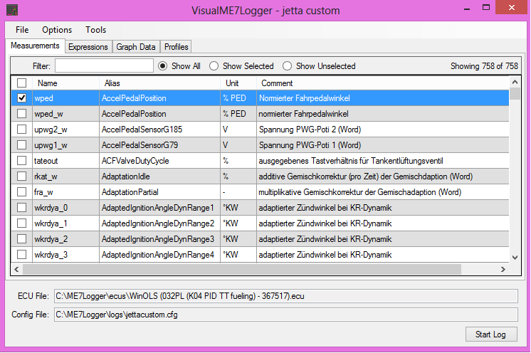
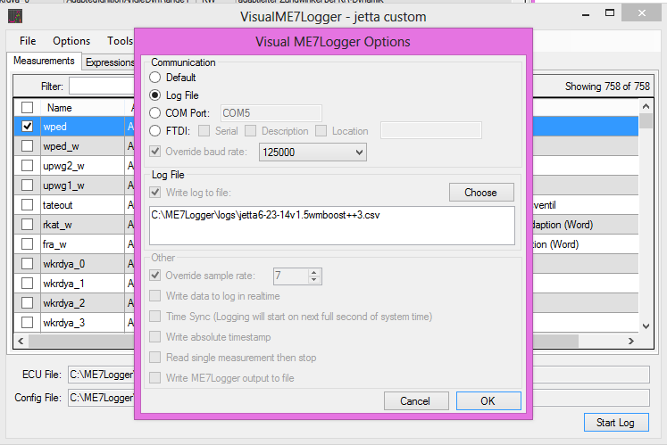
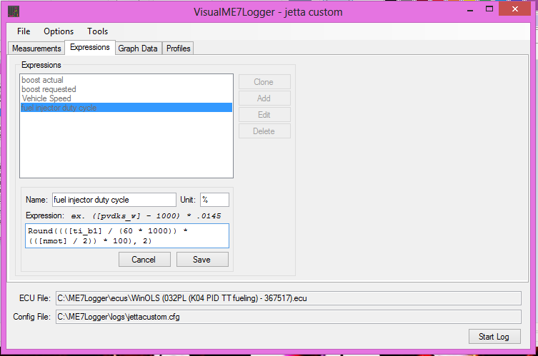
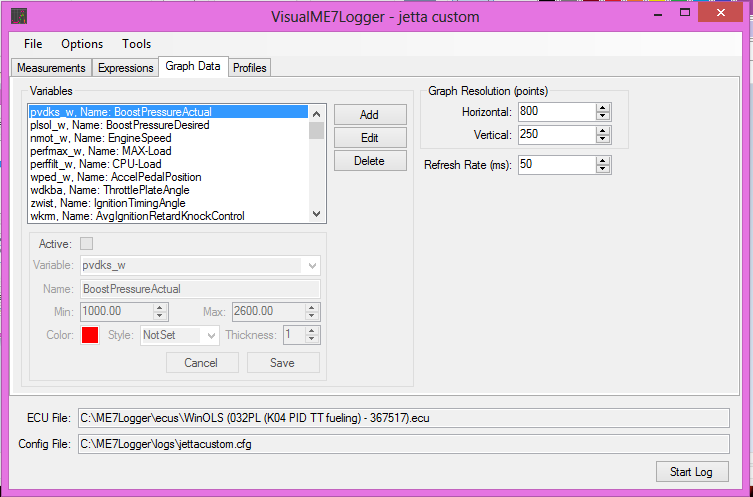
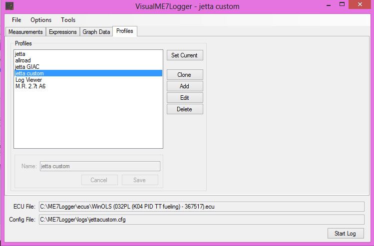
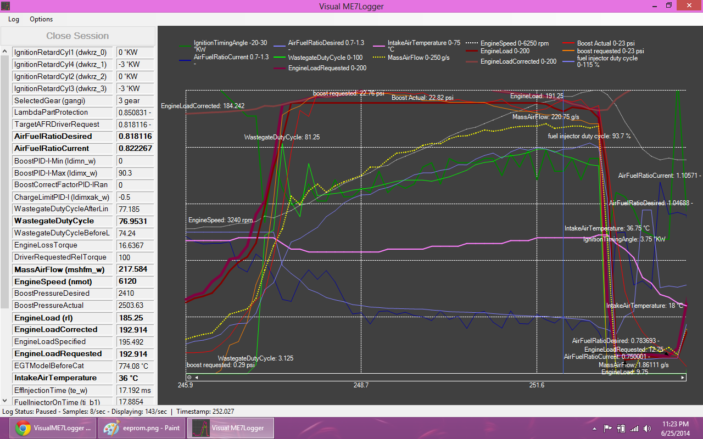
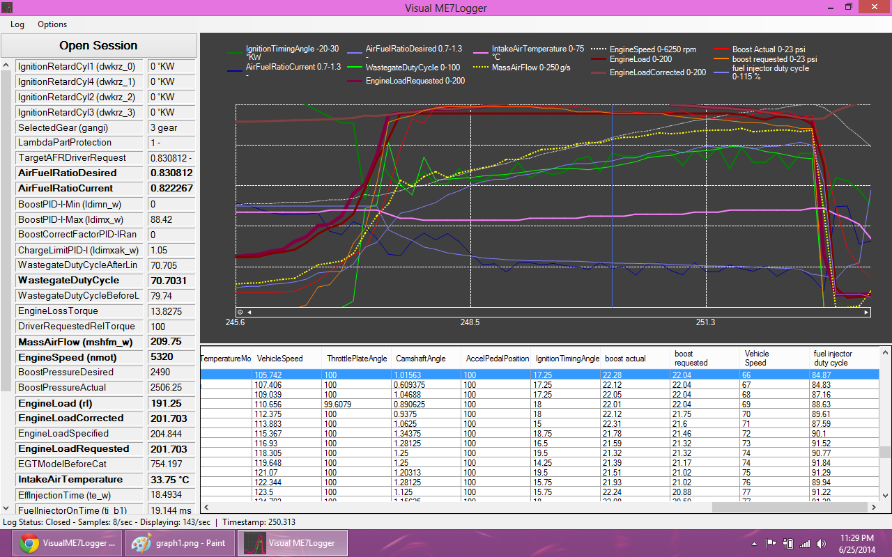
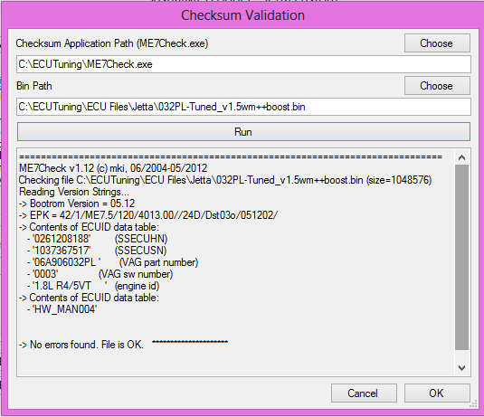
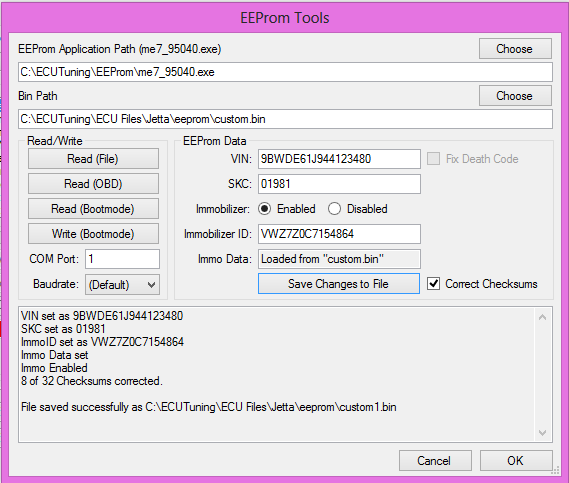

# VisualME7Logger

Graphical tools for logging real time performance statistics from VW and Audi automobiles

Integrates software commonly used to log engine performance of Audi and VW automobiles and make a graphical user interface to aid in ease of use and user experience:

* ME7Logger
* ME7Info
* ME7Check

Display real time logged data onto chart and labels.
Features:

* UI allows for easy configuration of logged variables and communication settings
* Playback from a log file
* Customize variables shown on the chart including min/max range, line color and thickness
* Display calculated values on the chart
* Zoom in and out
* Fast Forward data from log file
* Integration between chart and grid control

Extras:

Checksum validation:

EEProm Tools
Read/Write/Clone VIN, IMMO AND SKC as well as Checksum correction and Death Code Fix.

